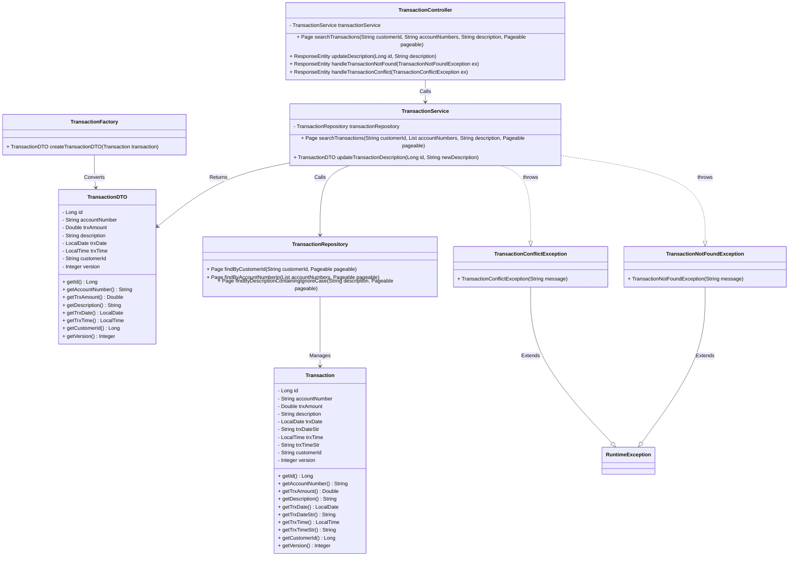
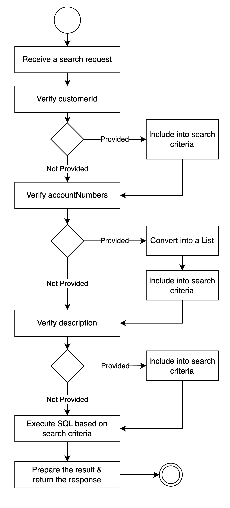
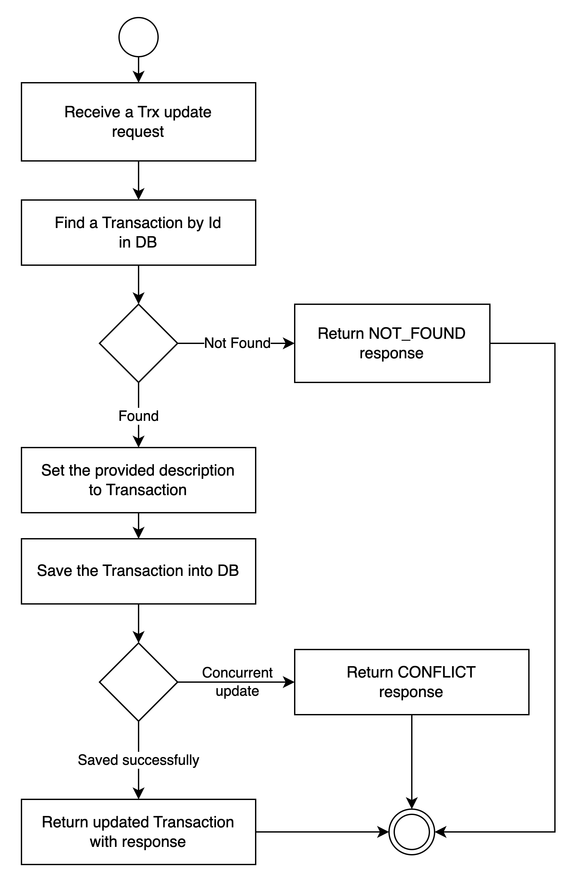

# Transaction Batch Processor


## 📝 Introduction

The **Transaction Batch Processor** is a powerful and efficient application designed to process transactions from a text file using batch jobs.

It also offers RESTful APIs to retrieve a pageable list of transactions filtered by customer ID, account number(s), or description. Additionally, an update API allows modifying a transaction’s description based on its ID.

The update operation ensures the transaction exists before updating and handles concurrent modifications. Both the search and update APIs are secured with basic authentication.

## 📜 Table of Contents
> - [Key Features](#-key-features)
> - [Prerequisites](#-prerequisites)
> - [Technology Stack](#-technology-stack)
> - [Design Pattern](#-design-patterns)
> - [Class Diagram](#-class-diagram)
> - [Activity Diagrams](#-activity-diagrams)
> - [Database Details](#-database-details)
> - [Installation](#-installation)
> - [API Documentation](#-api-documentation)
> - [API Usage](#-api-usage)
> - [Author](#-author)
> - [Acknowledgments](#-acknowledgments)

### ✨ Key Features
#### 1. Batch Processing for Transactions
✔ **Automated Transaction Ingestion** – Reads a structured text file containing transaction records.\
✔ **Efficient Data Processing** – Uses Spring Batch to process transactions in chunks, ensuring optimal memory usage.\
✔ **Database Storage** – Transactions are validated and persisted into the database for further processing and retrieval.\
✔ **Error Handling & Logging** – Captures errors in a structured log, preventing data corruption.

#### 2. RESTful APIs for Transaction Management
The application provides a set of RESTful APIs to interact with the stored transaction data:\
✔ **Transaction Search API** – Fetch a paginated list of transactions based on: Customer ID, Account Number(s), and Transaction Description.\
✔ **Transaction Update API** – Update the description of a transaction using its ID.

#### 3. Concurrency & Data Integrity
✔ **Existence Check Before Update** – Ensures that a transaction exists before applying an update.\
✔ **Optimistic Locking** – Uses concurrency control mechanisms to prevent conflicts when multiple users update the same transaction simultaneously. If a conflict occurs, an appropriate HTTP 409 (Conflict) response is returned.

#### 4. Security & Authentication
✔ **Basic Authentication** – Protects both the search and update APIs to prevent unauthorized access.\
✔ **Secure Data Access** – Ensures only authenticated users can retrieve or modify transactions.

### 5. Configurable & Flexible Architecture
✔ **Customizable Credential** – The username and password are configurable in application.properties.\
✔ **Customizable Database** – The database is configurable in application.properties.

### 📋 Prerequisites

Before you begin, make sure your environment is set up with the following:

- **Java 17**: Ensure the latest version is installed for compatibility.
- **Maven**: For managing dependencies and building the project.
- **GitHub Account**: To access the repository and CI/CD workflows.

### 🛠️ Technology Stack
✅ **Spring Boot** – For building RESTful APIs and configuring batch jobs.\
✅ **Spring Batch** – For efficient processing of transaction files.\
✅ **Spring Data JPA & H2 Database** – For transaction persistence and retrieval.\
✅ **Spring Security** – For enforcing Basic Authentication on APIs.\
✅ **Mermaid UML Diagrams** – Used for visualizing system architecture.

### 🏗 Design Patterns
This project implements various software design patterns to ensure a well-structured, scalable, and maintainable codebase. Below are the key design patterns used:
#### 1. Layered Architecture (N-tier)
The application follows a three-layered architecture to separate concerns between API, business logic, and database access:

- **Controller Layer (Presentation Layer)**: Handles HTTP requests.
- **Service Layer (Business Logic Layer)**: Contains business logic and rules.
- **Repository Layer (Data Access Layer)**: Manages database operations.

#### 2. Factory Pattern
This pattern decouples object creation from business logic.
- Example: TransactionFactory creates TransactionDTO objects from Transaction entities.

#### 3. DTO (Data Transfer Object) Pattern
DTOs prevent direct exposure of entity objects in APIs, enhancing security and performance. They facilitate data transfer between layers efficiently.

#### 4. Singleton Pattern
Ensures only one instance of a class exists in the application.
- Example: Spring Beans (@Service, @Repository) are Singletons by default.

#### 5. Proxy Pattern
Used for AOP-based transaction management in Spring.
- Example: Spring internally applies the Proxy Pattern for transaction handling.

#### 6. Step Pattern (Spring Batch)
Spring Batch follows the Step Pattern, where each step performs a specific task, ensuring modular and reusable processing.
Each step includes:
- ItemReader: Reads the text file.
- ItemProcessor: Processes the data.
- ItemWriter: Saves the data to the database.

#### 7. Adapter Pattern
Spring Batch uses the Adapter Pattern to integrate with external systems like databases and flat files.
- Example: ItemReader adapts TXT file input to Transaction objects, bridging data between different sources (TXT → DB).

#### 8. Exception Handling Pattern
A structured exception handling mechanism gracefully handles both expected and unexpected errors.
- Example: Custom exceptions like TransactionNotFoundException and TransactionConflictException.

### 📊 Class Diagram

### 🔄 Activity Diagrams
#### Transaction Search API


#### Transaction Update API


## 📂 Database Details
- **Database Name:** `maybank`
- **Table Name:** `transactions`

### 📋 Table Structure (`transactions`)

| Column Name      | Data Type       | Constraints     |
|------------------|-----------------|----------------|
| `id`            | `BIGINT(20)`    |Primary Key     |
| `account_number` | `VARCHAR(255)`  | Not Null       |
| `customer_id`    | `VARCHAR(255)`  | Not Null       |
| `description`    | `VARCHAR(255)`  | Nullable       |
| `trx_date`       | `TIMESTAMP`     | Not Null       |
| `trx_time`       | `TIMESTAMP`     | Not Null       |
| `version`        | `TIMESTAMP`     | Used for concurrency control |

This table stores transaction details, linking each transaction to an account and customer while maintaining version control for data consistency.

### ⚙️ Installation
Follow these steps to set up and run this application on your local machine:

1. **Clone the Repository**
   <br/>Start by cloning the GitHub repository to your local system:
   ```sh
    git clone https://github.com/zakirhossain-dsi/trx-batch-processor.git
    cd trx-batch-processor
    ```
   The above commands fetch the project code and navigate to the project directory respectively.<br/><br/>

2. **Build the Project with Maven**
   <br/>Use Maven to clean, compile, and package the application:
   ```sh
    mvn clean install
    ```
   This will ensure all dependencies are resolved and the project is packaged into a runnable JAR file.<br/><br/>

3. **Run the Application**
   <br/>Execute the packaged JAR file to start the application:
   ```sh
    java -jar target/trx-batch-processor-0.0.1-SNAPSHOT.jar
    ```
After running this command, the application should be accessible locally on the configured port (e.g., http://localhost:8080 by default).

### 📖 API Documentation
This application includes Swagger integration to provide comprehensive and interactive API documentation, making it easy to explore, test, and understand the available endpoints.
#### Accessing Swagger UI
Follow these steps to view and interact with the API documentation:
1. **Run the application**:
    - Start the application locally using `java -jar`, **Docker**, or **Kubernetes**. Ensure the application is running and accessible.
2. **Open Swagger UI**:
    - Launch your browser and navigate to the following URL. Replace `localhost:8080` with your application's host and port if running in a different environment.
      ```sh
      http://localhost:8080/swagger-ui.html
      ```

### 📡 API Usage
The Postman Collection for this application offers a well-structured and ready-to-use set of API requests, allowing developers and testers to efficiently interact with the application's endpoints.

**Details**
- **Name**: Transaction Batch Processor<br/>
- **Description**: This collection simplifies development and debugging by offering a structured way to explore the API.<br/>
- **Schema**: The Postman collection schema is available in JSON format and can be imported directly into Postman: <br/>
  [Download Schema](https://github.com/zakirhossain-dsi/trx-batch-processor/blob/master/docs/trx-batch-processor.postman_collection.json)

**Endpoints:**
1. **Search Transactions**
   - Purpose: Enables users to search for transactions based on specified query parameters.
   - Endpoint: `GET {{base_url}}/api/v1/transactions`
   - Authorization: 
     - Username: `admin` (default)
     - Password: `admin123` (default)
   - Query Parameters:
     - customerId=222
     - accountNumbers=8872838299
     - description=TRANSFER
     - page=0
     - size=10
     - sort=trxDate,asc

2. **Update Transaction**
   - Purpose: Enables users to update the description of a transaction based on specified transaction id.
   - Endpoint: `PUT {{base_url}}/api/v1/transactions/1`
   - Request Headers:
      - `Content-Type: application/json`
   - Request Body:
     ```json
     {
       "description": "Updated Transaction5"
     }
     ```

### 👤 Author
- [Md Zakir Hossain](https://www.linkedin.com/in/zakir-hossain-ict/)
- [Contact via Email](zakir.mbstu.ict07@gmail.com)

### 🙌 Acknowledgments
We sincerely thank the open-source community for their invaluable contributions. Special thanks to the maintainers of **Spring Boot**, **Spring Batch**, **Docker**, and **GitHub Actions** for providing tools that empower seamless development, deployment, and automation. Your efforts make projects like this possible!
